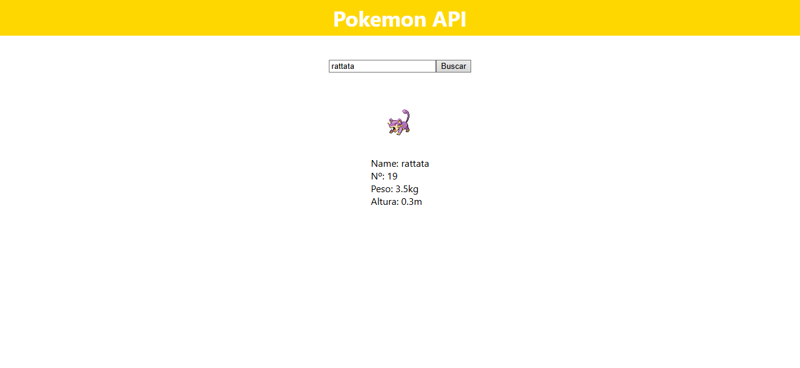

<h1 align="center">Pokedex</h1>

Este projeto é uma Pokédex interativa desenvolvida em React, que utiliza a PokéAPI para obter informações detalhadas sobre qualquer Pokémon. Com uma interface intuitiva, os usuários podem buscar por nome ou número e visualizar dados como nome, número na Pokédex, peso, altura e a imagem oficial do Pokémon. 
<a href="https://gabrielpiccirillo.github.io/Pokedex/">Teste aqui o Projeto</a>

<h1 align="center">Resultados:</h1>

 
 